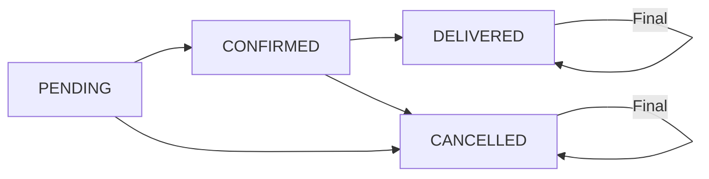

# 🛒 Order Service - Gestión de Órdenes

Microservicio de orquestación comercial que maneja el ciclo completo de órdenes en el ecosistema Products Market.

## 📋 Descripción

El Order Service es el coordinador central de transacciones comerciales, responsable de procesar órdenes, gestionar estados, coordinar con otros servicios y mantener la integridad transaccional del marketplace.

## 🛠️ Stack Tecnológico

- **Java 17**
- **Spring Boot 3.1.5**
- **Spring Data JPA**
- **MySQL 8.0**
- **Spring Cloud Netflix Eureka**
- **RestTemplate** para comunicación entre servicios
- **Spring Transactions** para atomicidad
- **JUnit 5 & Mockito**

## ⚡ Funcionalidades Principales

### 🚀 Orquestación de Órdenes
- Creación de órdenes con validación completa
- Coordinación automática con User Service y Product Service
- Verificación de stock en tiempo real
- Cálculo automático de precios totales

### 📊 Gestión de Estados Avanzada
- **Estados**: PENDING → CONFIRMED → DELIVERED
- **Cancelación inteligente** con devolución de stock
- **Validación de transiciones** de estado
- **Auditoría completa** de cambios

### 🔄 Integración Multi-Servicio
- **Validación de usuarios** via User Service
- **Verificación de productos** via Product Service
- **Control de stock** en tiempo real
- **Comunicación resiliente** con manejo de errores

### 🛡️ Transacciones Seguras
- **Atomicidad garantizada** con @Transactional
- **Rollback automático** en caso de errores
- **Compensación de stock** en cancelaciones
- **Validaciones exhaustivas** de datos

## 🔄 Estados del Ciclo de Vida



### Reglas de Negocio
- **PENDING**: Orden creada, esperando confirmación
- **CONFIRMED**: Orden confirmada, stock reservado
- **CANCELLED**: Orden cancelada, stock devuelto
- **DELIVERED**: Orden entregada (estado final)

## 🌐 Endpoints de la API

### Operaciones CRUD de Órdenes

| Método | Endpoint | Descripción |
|--------|----------|-------------|
| `POST` | `/api/orders` | Crear nueva orden |
| `GET` | `/api/orders` | Obtener todas las órdenes |
| `GET` | `/api/orders/{id}` | Obtener orden por ID |
| `DELETE` | `/api/orders/{id}` | Eliminar orden |

### Endpoints Gateway (Puerto 8087)

| Método | Endpoint Gateway | Descripción |
|--------|------------------|-------------|
| `POST` | `http://localhost:8087/api/orders` | Crear nueva orden |
| `GET` | `http://localhost:8087/api/orders` | Obtener todas las órdenes |
| `GET` | `http://localhost:8087/api/orders/{id}` | Obtener orden específica |
| `DELETE` | `http://localhost:8087/api/orders/{id}` | Eliminar orden |

### Endpoints de Consultas Especializadas

| Método | Endpoint Gateway | Descripción |
|--------|------------------|-------------|
| `GET` | `http://localhost:8087/api/orders/user/{userId}` | Órdenes por usuario |
| `GET` | `http://localhost:8087/api/orders/product/{productId}` | Órdenes por producto |
| `GET` | `http://localhost:8087/api/orders/status/{status}` | Órdenes por estado |
| `GET` | `http://localhost:8087/api/orders/recent` | Órdenes recientes (24h) |

### Endpoints de Gestión de Estados

| Método | Endpoint Gateway | Descripción |
|--------|------------------|-------------|
| `PUT` | `http://localhost:8087/api/orders/{id}/status` | Actualizar estado |
| `PUT` | `http://localhost:8087/api/orders/{id}/cancel` | Cancelar orden |

### Endpoints de Analytics y Estadísticas

| Método | Endpoint Gateway | Descripción |
|--------|------------------|-------------|
| `GET` | `http://localhost:8087/api/orders/stats/total` | Total de órdenes |
| `GET` | `http://localhost:8087/api/orders/stats/status/{status}` | Conteo por estado |
| `GET` | `http://localhost:8087/api/orders/stats/sales` | Total de ventas |

**Parámetros de estado válidos:**
- `PENDING`, `CONFIRMED`, `CANCELLED`, `DELIVERED`

**Parámetros de consulta:**
- `status`: Estado de orden (enum)
- `userId`: ID del usuario
- `productId`: ID del producto

## 📋 Modelo de Datos

```java
@Entity
public class Order {
    private Long id;                    // ID único autogenerado
    private Long userId;                // ID del usuario (FK)
    private Long productId;             // ID del producto (FK)
    private Integer quantity;           // Cantidad ordenada (> 0, ≤ 1000)
    private BigDecimal totalPrice;      // Precio total calculado
    private LocalDateTime orderDate;    // Fecha de la orden
    private OrderStatus status;         // Estado actual
    private LocalDateTime createdAt;    // Fecha de creación
    private LocalDateTime updatedAt;    // Última modificación
}
```

### DTOs para Comunicación
```java
// Request para crear orden
public class CreateOrderRequest {
    private Long userId;        // Requerido
    private Long productId;     // Requerido
    private Integer quantity;   // Requerido (1-1000)
}

// DTOs de servicios externos
public class UserDto { /* datos del usuario */ }
public class ProductDto { /* datos del producto */ }
```

## ⚙️ Configuración del Servicio

```properties
server.port=8083
spring.datasource.url=jdbc:mysql://localhost:3306/marketjosemsp
spring.datasource.username=root
spring.datasource.password=****
eureka.client.service-url.defaultZone=http://localhost:8761/eureka/
```

### URLs de Servicios Externos
```properties
product.service.url=http://product-service
user.service.url=http://user-service
```

## 🚀 Orden de Ejecución

1. **Iniciar MySQL** en puerto 3306
2. **Iniciar Eureka Server** en puerto 8761
3. **Iniciar API Gateway** en puerto 8087
4. **Iniciar User Service** en puerto 8081
5. **Iniciar Product Service** en puerto 8082
6. **Ejecutar Order Service** en puerto 8083

### Verificar funcionamiento:
- **Directo**: [http://localhost:8083/api/orders](http://localhost:8083/api/orders)
- **Gateway**: [http://localhost:8087/api/orders](http://localhost:8087/api/orders)

## 🎭 Coordinación de Servicios

### Flujo de Creación de Órdenes
```java
1. Validar datos de entrada
2. Verificar usuario → User Service
3. Verificar producto → Product Service  
4. Comprobar stock disponible → Product Service
5. Calcular precio total (producto.precio × cantidad)
6. Crear orden en estado CONFIRMED
7. Reducir stock → Product Service (opcional)
8. Persistir orden en base de datos
```

### Coordinación Inter-Servicios
- **User Service**: Validación de existencia de usuarios
- **Product Service**: Verificación de productos y gestión de stock
- **API Gateway**: Enrutamiento y balanceador de carga

## 🧠 Lógica de Negocio Avanzada

### Validaciones Automáticas
```java
// Validación de usuario
if (userId <= 0) → OrderValidationException

// Validación de producto  
if (productId <= 0) → OrderValidationException

// Validación de cantidad
if (quantity <= 0 || quantity > 1000) → OrderValidationException

// Verificación de stock
if (requestedQuantity > availableStock) → InsufficientStockException
```

### Gestión de Estados Transaccional
- **Transiciones válidas**: Definidas por reglas de negocio
- **Rollback automático**: En caso de errores de comunicación
- **Compensación de stock**: Devolución automática en cancelaciones

### Cálculos Financieros
- **Precisión decimal**: BigDecimal para operaciones monetarias
- **Cálculo automático**: precio × cantidad = total
- **Agregación de ventas**: Solo órdenes CONFIRMED

## 🚨 Manejo de Errores Robusto

### Excepciones Específicas del Dominio
- **OrderNotFoundException**: Orden inexistente (404)
- **OrderValidationException**: Datos inválidos (400)
- **InsufficientStockException**: Stock insuficiente (409)
- **OrderStatusException**: Transición inválida (400)
- **OrderCancellationException**: Cancelación no permitida (400)

### Excepciones de Comunicación
- **UserServiceException**: Error comunicando con User Service
- **ProductServiceException**: Error comunicando con Product Service
- **ExternalServiceException**: Error genérico de servicios externos
- **StockOperationException**: Error en operaciones de stock

### Resilencia y Recuperación
- **Timeouts configurables** para llamadas REST
- **Logs detallados** para troubleshooting
- **Fallback graceful** en operaciones de stock
- **Compensación automática** en cancelaciones

## 🏪 Casos de Uso del Marketplace

### Flujo de Compra
- Cliente selecciona producto y cantidad
- Sistema verifica disponibilidad de stock
- Creación automática de orden
- Confirmación instantánea o gestión de estado

### Gestión Administrativa
- Seguimiento de órdenes por usuario
- Análisis de productos más vendidos
- Gestión de cancelaciones con compensación
- Reportes de ventas y estadísticas

### Operaciones Comerciales
- **Control de inventario** integrado
- **Gestión de devoluciones** automática
- **Analytics de ventas** en tiempo real
- **Trazabilidad completa** de transacciones

### Análisis y Reportes
- Total de órdenes por estado
- Volumen de ventas consolidado
- Productos más demandados
- Estadísticas de usuarios activos

---
## 👨‍ Autor

### **Jose Manuel Siguero Pérez**
### [Linkedin](https://www.linkedin.com/in/jose-manuel-siguero)

**Coordinador Central del Sistema de Microservicios Products Market**